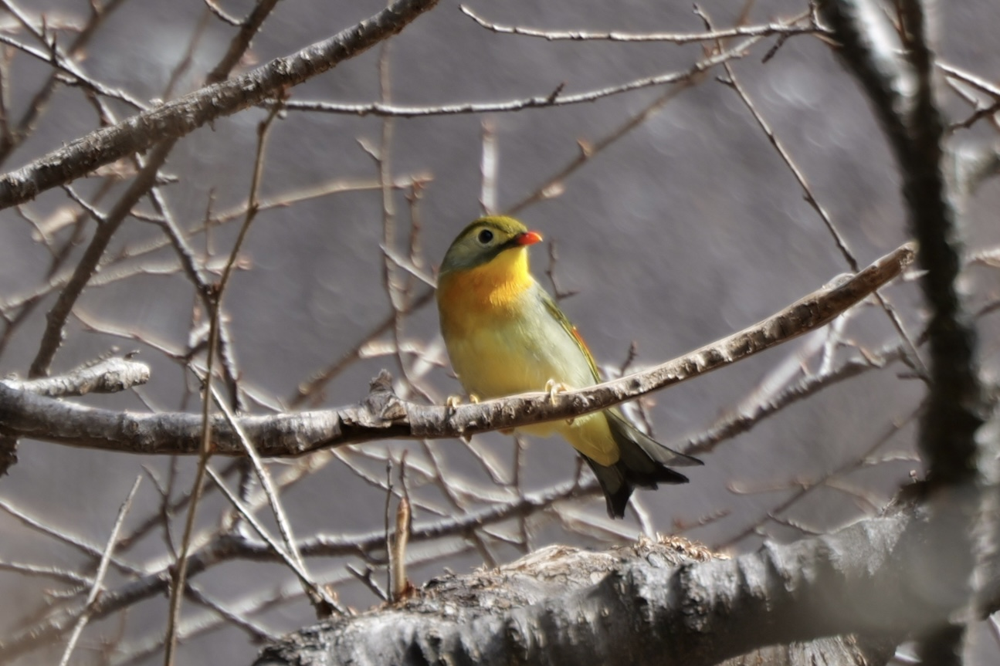
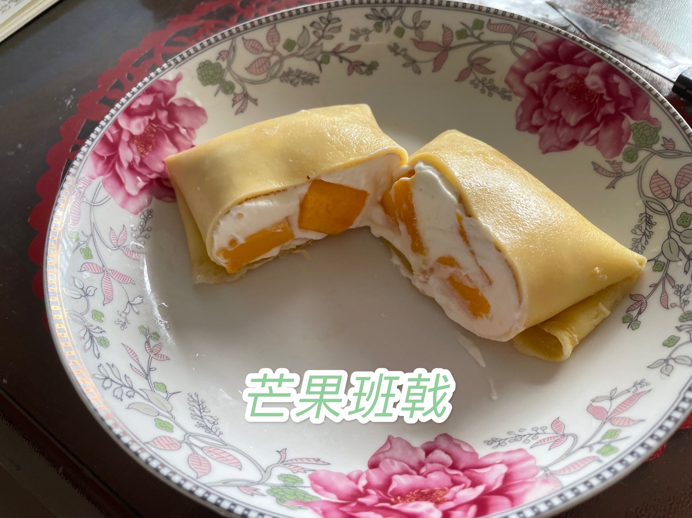
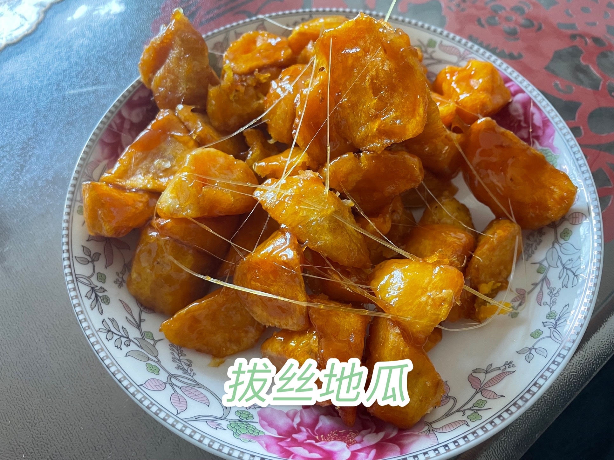
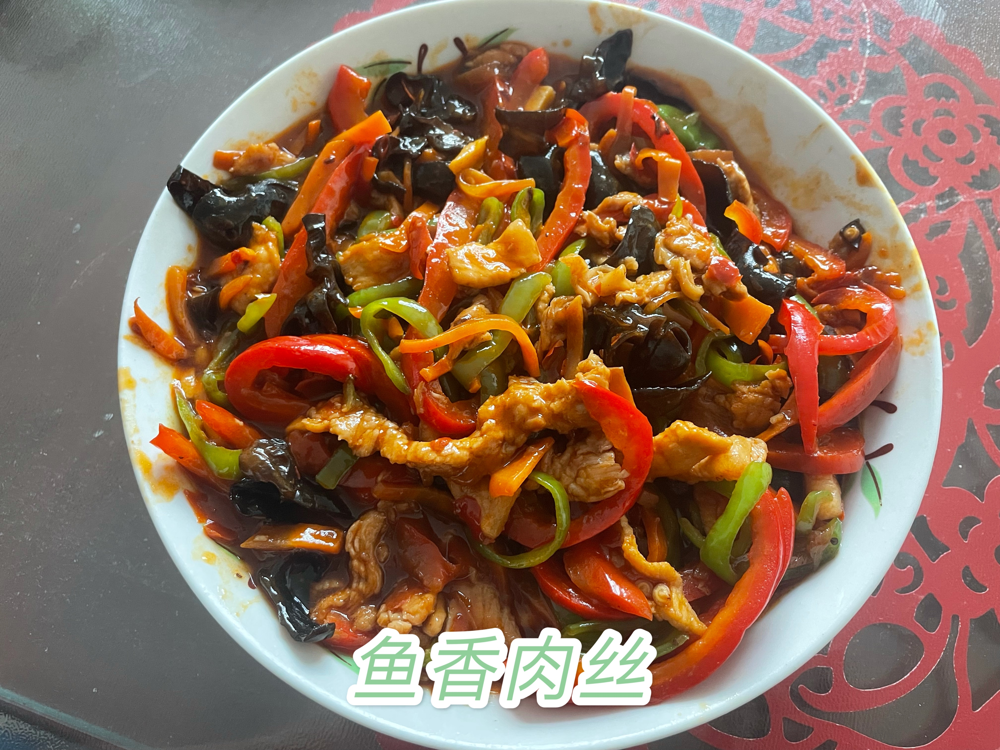
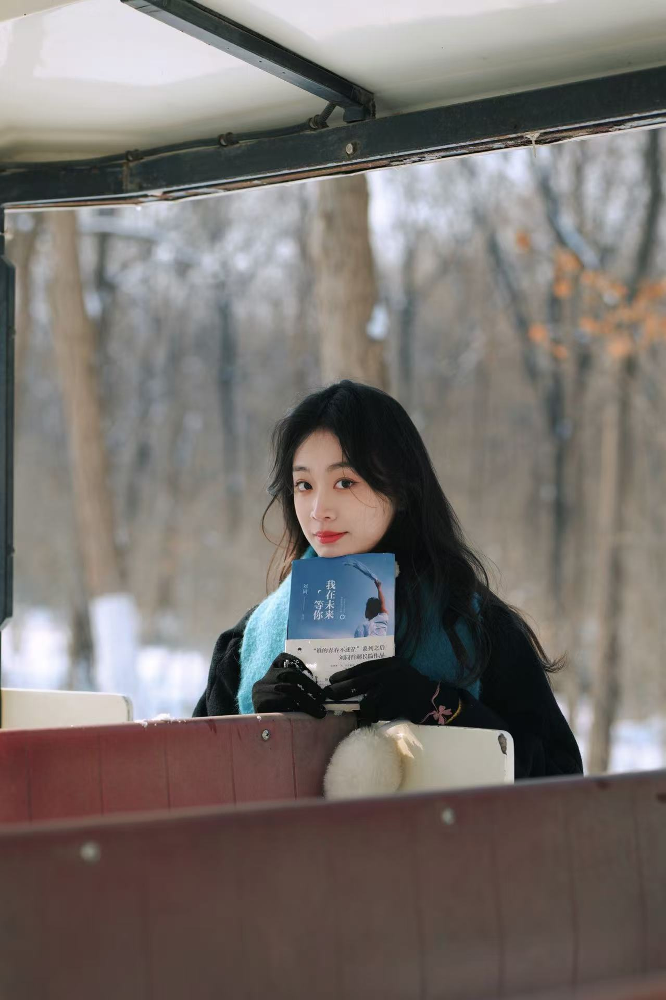
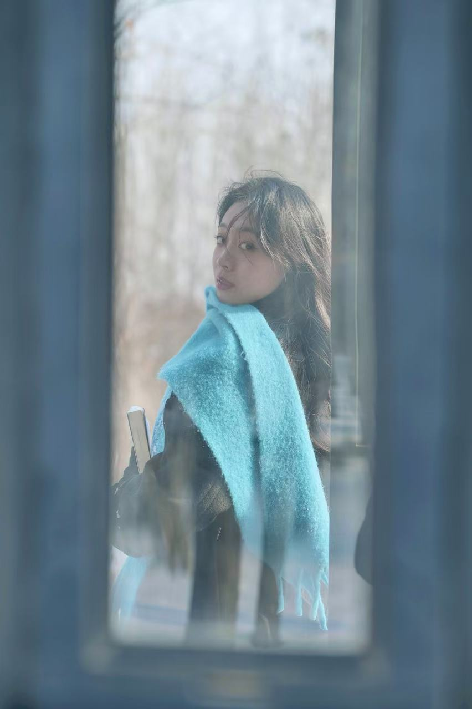
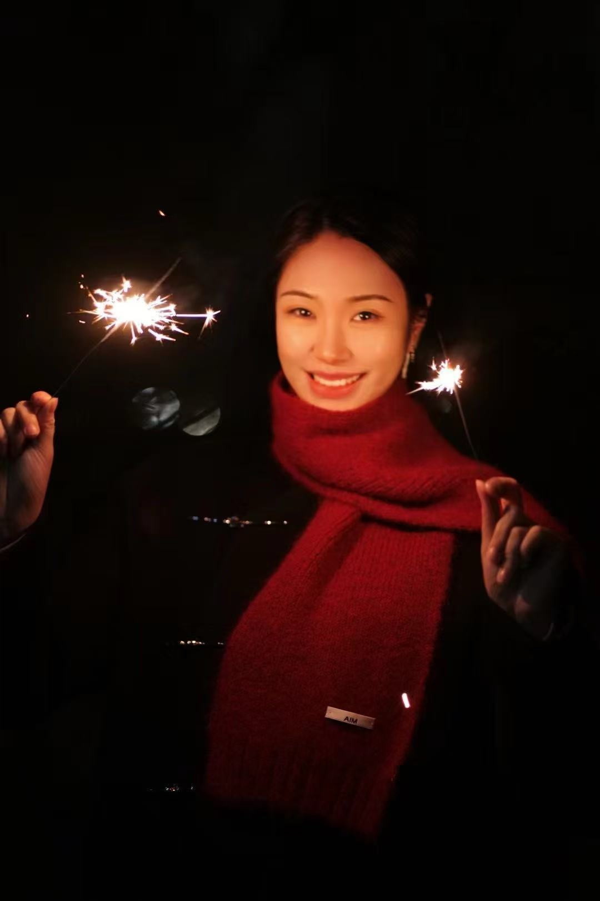
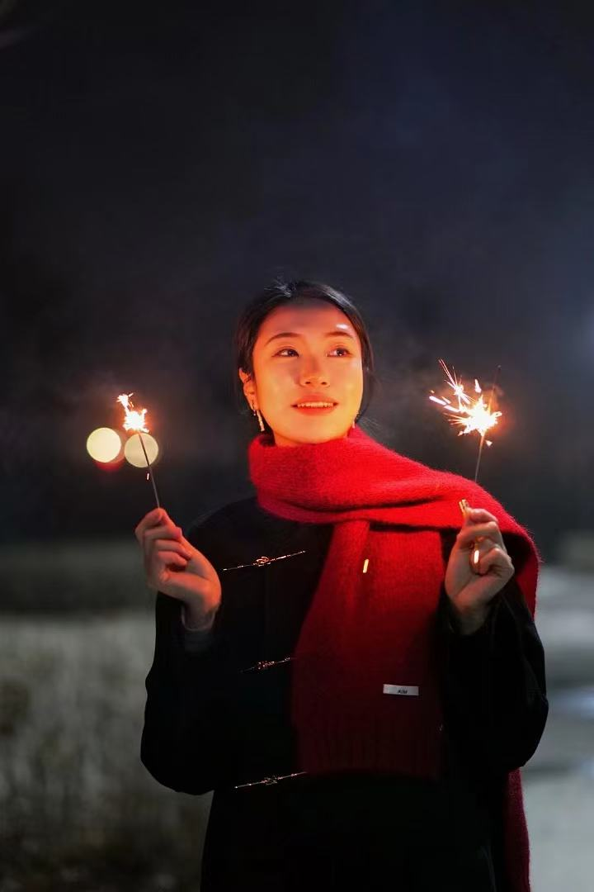
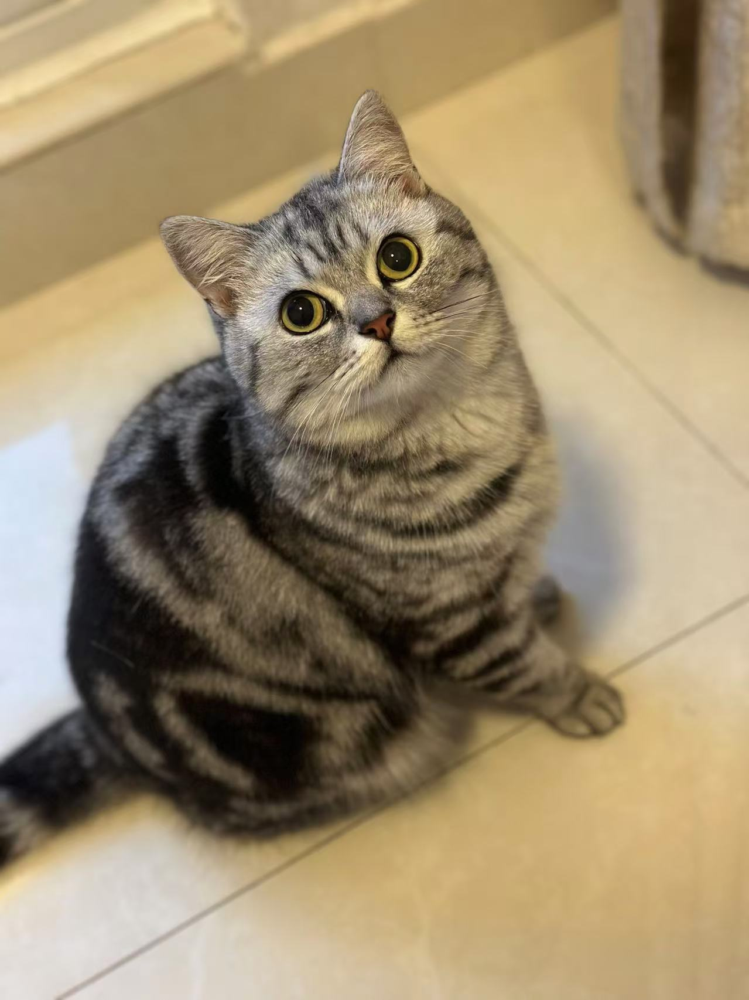

# 👤 Bio
I got my Ph.D. degree at [University of Science and Technology of China (USTC)](https://www.ustc.edu.cn/), where I was fortunate to be advised by [Prof. Xiang-Yang Li](http://staff.ustc.edu.cn/~xiangyangli/) (ACM Fellow, IEEE Fellow). Now, I am working at [Ocean University of China (OUC)](https://www.ouc.edu.cn/main.htm). My research interests include IoT, Wireless Sensing, and Ubiquitous Computing. I am eager to connect and collaborate with fellow researchers interested in these areas. Feel free to reach out to me via email😆.

# 🎓 Education
- **2019.09 - 2024.12**&emsp;Ph.D. in School of Computer Science and Technology, University of Science and Technology of China
- **2014.09 - 2019.06**&emsp;B.E. in School of Computer Science and Information Engineering, Hefei University of Technology
- **2017.09 - 2018.01**&emsp;Exchange Student in Department of Computer Science, National Tsing Hua University

# 📰 News
- **[2025.05]** 🎉 Our paper *"SEGUS: A Semantic Element Gesture Understanding System via Symbol-Path Decoupling"* has been accepted by **IEEE ICCCN 2025 (CCF-C)**. Congratulations to Tianyi!
- **[2025.05]** 🎉 Our paper *"XHGA: Expanding the Capabilities of Cross-Modal Wrist-Worn Devices for Multi-Task Hand Gesture Applications"* has been accepted by **IEEE TMC 2025 (CCF-A)**.
- **[2025.05]** 🎉 Our two paper *"Indoor Localization from Large-scale Poor-quality Crowdsourcing WiFi Data for On-demand Delivery"* and *"InvisiCode: Boosting Intra-Frame Screen-Camera Communication by Breaking Through Noise Limitations*" have been accepted by **IEEE/ACM IWQoS 2025 (CCF-B)**. Congratulations to Shicheng, Haikuo and Jingmiao!
- **[2025.04]** 🎉 Our paper *"ChannelZip: SLO-Aware Channel Compression for Task-Adaptive Model Serving on IoT Devices."* has been accepted by **ACM TOSN 2025 (CCF-B)**. Congratulations to Puhan!
- **[2024.12]** 🎉 Our context-aware project in collaboration with Huawei has successfully completed! We extend our sincere gratitude to Huawei, as well as to all the students and collaborators whose efforts and dedication made this achievement possible!
- **[2024.11]** 🎉 Our team achieved multiple awards at **泛在智能感知技术创新应用大赛**. The project *"可拍不可见：基于屏幕拍摄的设备通信"* won the second prize. Four projects received third prizes: *"多模态融合的设备握持状态感知"*, *"基于超声波与陀螺仪的侧信道安全通信方案"*, *"基于多模态融合的移动设备位置感知"* and *"基于移动设备的多模态融合距离感知"*. Congratulations to Haikuo, Jingmiao, Yichao, Junyang, Yiyu, Xiao and all collaborators!
- **[2024.10]** 🥳 I am thrilled to announce that I have successfully completed my Ph.D. thesis defense! I am deeply grateful to my supervisor, Prof. Xiang-Yang Li, for his invaluable guidance and support throughout my doctoral journey.
- **[2024.10]** 🎉 Our two papers *"WowSense: A High-Accuracy Real-Time Grip-State Sensing on Commodity Smartphones."* and *"InOut: Lightweight Transferable Multimodal Indoor-Outdoor Detection System with Smartphones."* have been accepted by **IEEE MSN 2024 (CCF-C)**. Congratulations to Yichao and Yiyu!
- **[2024.10]** 🎉 Our paper *"SGSM: Semi-generalist Sensing Model Combining Handcrafted and Deep Learning Methods."* has been published in International Journal of Machine Learning and Cybernetics **(JCR-Q2)**. Congratulations to Tianjian!
- **[2024.06]** 🥳 I am truly honored to be recognized as an **Outstanding Graduate of Anhui Province (安徽省优秀毕业生)** and an **Outstanding Graduate of the University of Science and Technology of China (中国科大优秀毕业生)**. This honor is a significant affirmation of my work during my doctoral studies, and I am deeply grateful to all the teachers and classmates who have supported and helped me along the way.

# 📚 Publications
(\* indicates corresponding author; † indicates equal contribution.)

**---2025---**

- [ICCCN'25] **SEGUS: A Semantic Element Gesture Understanding System via Symbol-Path Decoupling**  
   Tianyi Xu, Hao Zhou, **Kaiwen Guo**, Xiaoyan Wang, Zhi Liu.  
   *IEEE International Conference on Computer Communications and Networks* **IEEE ICCCN 2025 (CCF-C)**

- [TMC'25] **XHGA: Expanding the Capabilities of Cross-Modal Wrist-Worn Devices for Multi-Task Hand Gesture Applications**  
   **Kaiwen Guo**, Hui Tang, Tianyi Xu, Hao Zhou, Mengxia Lyu, Zhi Liu, Xiaoyan Wang, Xiang-Yang Li.  
   *IEEE Transactions on Mobile Computing* **IEEE TMC 2025 (CCF-A)**

- [IWQoS'25] **Indoor Localization from Large-scale Poor-quality Crowdsourcing WiFi Data for On-demand Delivery.**  
   **Kaiwen Guo**, Shicheng Zheng *(Equal Contribution)*, Hao Zhou, Yan Zhang, Keli Yan, Guobin Shen, Haohua Du, Xiang-Yang Li.  
   *IEEE/ACM International Symposium on Quality of Service* **IEEE/ACM IWQoS 2025 (CCF-B)**

- [IWQoS'25] **InvisiCode: Boosting Intra-Frame Screen-Camera Communication by Breaking Through Noise Limitations.**  
   Haikuo Yu, Jingmiao Zhang *(Equal Contribution)*, Haohua Du, **Kaiwen Guo**, Xiang-Yang Li.  
   *IEEE/ACM International Symposium on Quality of Service* **IEEE/ACM IWQoS 2025 (CCF-B)**

- [TOSN'25] **ChannelZip: SLO-Aware Channel Compression for Task-Adaptive Model Serving on IoT Devices.**  
   Puhan Luo, Jiahui Hou, Haisheng Tan, Mu Yuan, Guangyu Wu, **Kaiwen Guo**, Zhiqiang Wang, Xiang-Yang Li.  
   *ACM Transactions on Sensor Networks* **(ACM TOSN 2025, CCF-B)**
  
**---Before 2025---**

- [INFOCOM'22] **Mudra: A Multi-Modal Smartwatch Interactive System with Hand Gesture Recognition and User Identification.**  
   **Kaiwen Guo**, Hao Zhou, Ye Tian, Wangqiu Zhou, Yusheng Ji, Xiang-Yang Li.  
   *IEEE Conference on Computer Communications* **(IEEE INFOCOM 2022, CCF-A)**

- [SECON'23] **PianoWatch: An Intelligent Piano Understanding and Evaluation System Using Smartwatch.**  
   **Kaiwen Guo**, Hao Zhou, Siyu Jing, Haohua Du, Puhan Luo, Jiahui Hou, Xiang-Yang Li.  
   *IEEE Conference on Sensing, Communication, and Networking* **(IEEE SECON 2023, CCF-B)**

- [MSN'20] **FD-Band: A Ubiquitous Fall Detection System Using Low-Cost COTS Smart Band.**  
   **Kaiwen Guo**, Yingling Quan, Hao Zhou, Zhi Liu, Panlong Yang, Xiang-Yang Li.  
   *IEEE Conference on Mobility, Sensing and Networking* **(IEEE MSN 2020, CCF-C)**

- [MSN'24] **WowSense: A High-Accuracy Real-Time Grip-State Sensing on Commodity Smartphones.**  
   Yichao Gao, **Kaiwen Guo** *(Corresponding Author)*, Chuanzi Zhang, Yiyu Xin, Feiyu Han, Haohua Du, Xiang-Yang Li.  
   *IEEE Conference on Mobility, Sensing and Networking* **(IEEE MSN 2024, CCF-C)**

- [MSN'24] **InOut: Lightweight Transferable Multimodal Indoor-Outdoor Detection System with Smartphones.**  
   Yiyu Xin, Chuanzi Zhang, **Kaiwen Guo** *(Corresponding Author)*, Yichao Gao, Haohua Du, Xiang-Yang Li.  
   *IEEE Conference on Mobility, Sensing and Networking* **(IEEE MSN 2024, CCF-C)**

- [INFOCOM'24] **MultiHGR: Multi-Task Hand Gesture Recognition with Cross-Modal Wrist-Worn Devices.**  
   Mengxia Lyu, Hao Zhou, **Kaiwen Guo**, Wangqiu Zhou, Xingfa Shen, Yu Gu.  
   *IEEE Conference on Computer Communications* **(IEEE INFOCOM 2024, CCF-A)**

- [INFOCOM'22] **Shield: Safety Ensured High-efficient Scheduling for Magnetic MIMO Wireless Power Transfer System.**  
   Wangqiu Zhou, Hao Zhou, Xiaoyu Wang, **Kaiwen Guo**, Haisheng Tan, Xiang-Yang Li.  
   *IEEE Conference on Computer Communications* **(IEEE INFOCOM 2022, CCF-A)**

- [SenSys'22] **HideSeeker: Uncover the Hidden Gems in Obfuscated Images.**  
   Suyuan Liu, Lan Zhang, Haikuo Yu, Jiahui Hou, **Kaiwen Guo**, Xiang-Yang Li.  
   *ACM Conference on Embedded Networked Sensor Systems* **(ACM SenSys 2022, CCF-B)**

- [IJMLC'24] **SGSM: Semi-generalist Sensing Model Combining Handcrafted and Deep Learning Methods.**  
   Tianjian Yang, Hao Zhou, Shuo Liu, **Kaiwen Guo**, Yiwen Hou, Haohua Du, Xiang-Yang Li.  
   *International Journal of Machine Learning and Cybernetics* **(JCR-Q2)**

- [IWQoS'24] **SGSM: A Foundation-model-like Semi-generalist Sensing Model.**  
    Tianjian Yang, Hao Zhou, Shuo Liu, **Kaiwen Guo**, Yiwen Hou, Haohua Du, Zhi Liu, Xiang-Yang Li.  
    *IEEE/ACM International Symposium on Quality of Service* **(IEEE/ACM IWQOS 2024, CCF-B)**

- [MSN'21] **IMFi: IMU-WiFi based Cross-modal Gait Recognition System with Hot-Deployment.**  
    Zengyu Song, Hao Zhou, Shan Wang, Jinmeng Fan, **Kaiwen Guo**, Wangqiu Zhou, Xiaoyan Wang, Xiang-Yang Li.  
    *IEEE Conference on Mobility, Sensing and Networking* **(IEEE MSN 2021, CCF-C)**

# 🎙️ Talks
- **[2024.08]** **All-scene Collaborative Sensing and Interaction - Some Practical Applications in Real-world**  
  *@ The 10th International Conference of Big Data Computing and Communications, Dalian, China*

# 👨‍🏫 Teaching Experience
- **[2023/2023 Fall]**&emsp;**Teaching Assistant**, Science and Society, Instructor: Prof. Xiang-Yang Li, USTC
- **[2022 Spring]**&emsp;**Teaching Assistant**, Applied Mathematics for Computer Science, Instructor: Prof. Qi Song, USTC
- **[2021 Fall]**&emsp;**Teaching Assistant**, Combinatorial Mathematics, Instructor: Dengdi Sun, USTC
- **[2019 Fall]**&emsp;**Teaching Assistant**, Advanced Software Engineering, Instructor: Prof. Hao Zhou, USTC

# 📝 Academic Services
- **Journal Reviewer**  
  - *IEEE Internet of Things Journal*

# 🏆 Honors and Awards
- **[2024.10]**&emsp;Jiaolong Second-Class Scholarship, USTC
- **[2024.06]**&emsp;Outstanding Graduate of Anhui Province
- **[2024.06]**&emsp;Outstanding Graduate of the University of Science and Technology of China
- **[2023.10]**&emsp;Longfor Scholarship, USTC
- **[2022.10]**&emsp;Suzhou Industrial Park Scholarship, USTC
- **[2021.06]**&emsp;Outstanding Communist Party Member of the University of Science and Technology of China
- **[2020.10]**&emsp;Shenzhen Stock Exchange Scholarship, USTC
- **[2019-2024]**&emsp;First-Class Academic Scholarship, USTC

# 🧬 Academic Ancestors
Me --> [Xiang-Yang Li](http://staff.ustc.edu.cn/~xiangyangli/) (ACM Fellow, IEEE Fellow) --> [Shang-Hua Teng](https://en.wikipedia.org/w/index.php?title=Shang-Hua_Teng) (ACM Fellow, Godel Prize, Fulkerson Prize) --> [Gary Miller](https://en.wikipedia.org/wiki/Gary_Miller_(computer_scientist)) (ACM Fellow, Knuth Prize, Paris Kanellakis Award) --> [Manuel Blum](https://en.wikipedia.org/wiki/Manuel_Blum) (**Turing Award**, 1995; three students won Turing Award) --> [Marvin Minsky](https://en.wikipedia.org/wiki/Marvin_Minsky) (**Turing Award**, 1969; two students won Turing Award) --> Albert W. Tucker (known for Karush–Kuhn–Tucker conditions) --> Solomon Lefschetz (National Medal of Science, Fellow of the Royal Society) --> William Edward Story -->   ... ,  --> Poisson --> Lagrange --> Euler --> Bernoulli, .....

# 🤝 Acknowledgments
## 🏢 Companies and Organizations
I would like to extend my heartfelt gratitude to the companies and organizations (such as [LINKE](https://linke.ustc.edu.cn/main.htm), Huawei, Eleme, Huami, etc.) that have collaborated with me on various projects. Their support and partnership have been invaluable in advancing our work. 

  

## 🧑‍🤝‍🧑 My Best Collaborators
Furthermore, I am deeply grateful to my research collaborators who have made significant contributions to my academic journey. They include, but are not limited to (only introducing those with personal webpages):
- [Hao Zhou](https://cs.ustc.edu.cn/2020/0905/c23239a460148/page.htm), now Associate Professor at USTC, research interests include wireless charging and wireless sensing.
- [Haohua Du](https://cst.buaa.edu.cn/info/1113/2720.htm), now Assistant Professor at BUAA, research interests include mobile computing and IoT security.
- [Feiyu Han](https://fyhancs.github.io/), now at NUIST, research interests include mobile/wireless sensing and ubiquitous computing.
- [Fei Shang](https://zaoanhh.github.io/), now Ph.D. Candidate at USTC, research interest is wireless sensing.
- [Jingmiao Zhang](https://glycineeeee.github.io/), now Master Student at USTC, research interests include security and privacy in IoT systems and machine learning. She is seeking 2025 summer research internships and Ph.D. opportunities for Fall 2026 worldwide 🔥.
- [Shicheng Zheng](https://about.scsccc.com/), now Joint-Ph.D. Student of MSRA and USTC, research interests include wireless, network and artificial intelligence. Thanks to him for providing the convenient network infrastructure and GPT 😄.
- [Ye Tian](https://scholar.google.com/citations?user=P3hRr2wAAAAJ&hl=en), now Ph.D. Candidate at UCSD,  research interests include mobile computing and ubiquitous computing.
- [Chao Liu](https://ouc-chao-liu.github.io/main/), now Associate Professor at OUC, research interests include mobile computing and ubiquitous computing.
- ...

## 🌟 Hobbies
Beyond my academic research, I am passionate about exploring and experiencing different hobbies, which bring joy and inspiration to my life. My interests include photography, culinary, and gaming.

    
    
    
    
    
    
    
    
    
    
    
    
    

 
And see my cute cat - Ximi 🐈.

